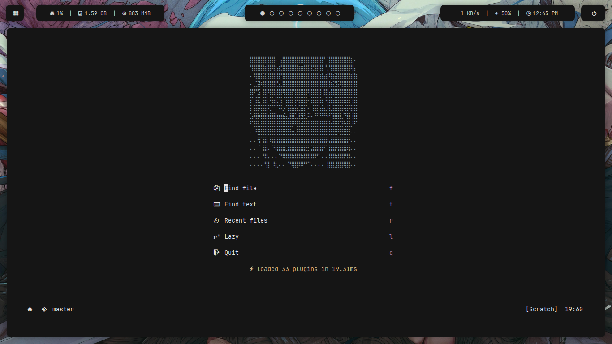
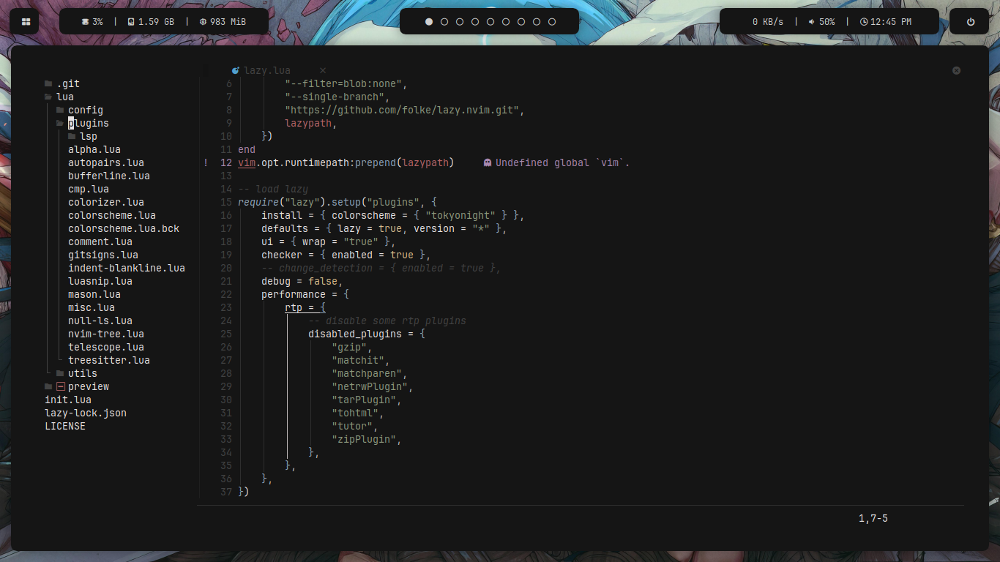
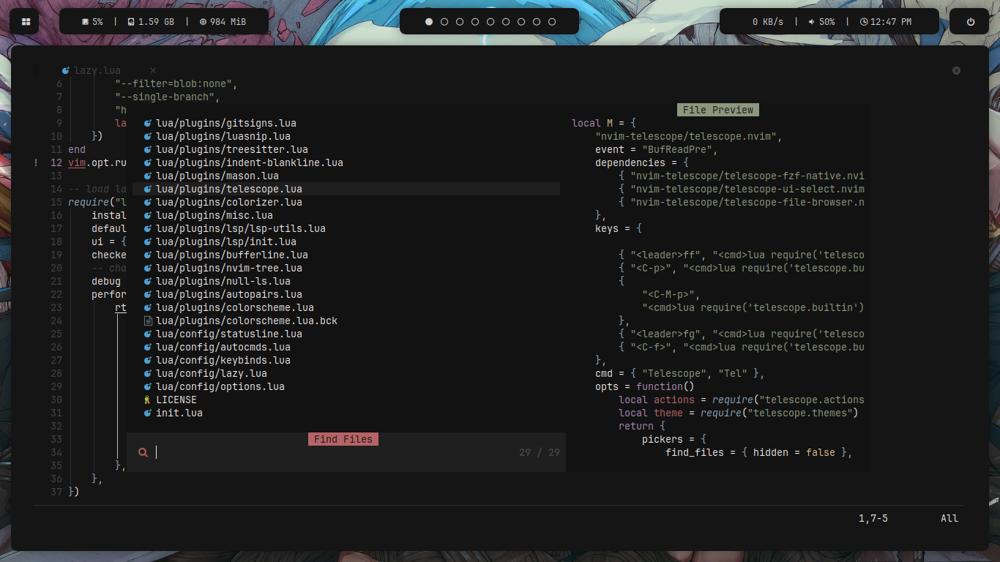
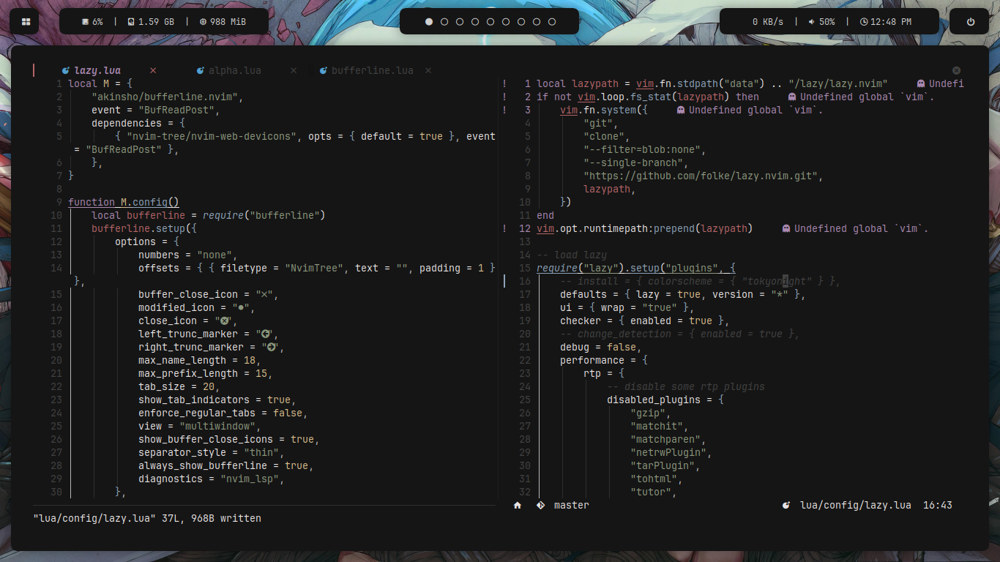
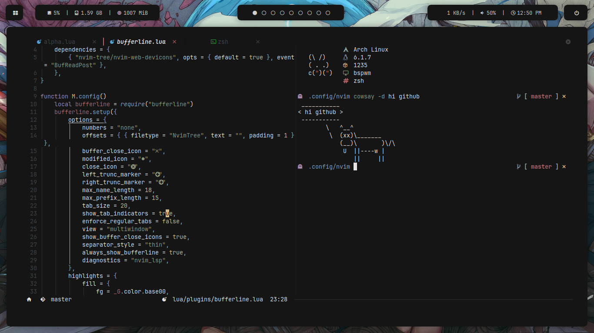
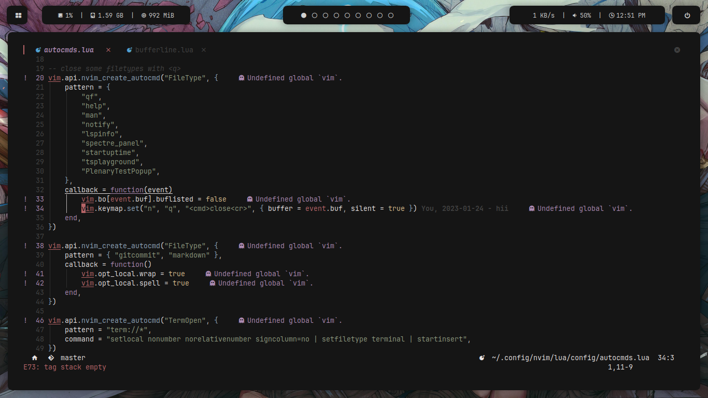

# NOTE: This project is no longer maintained. The repository has been moved to [https://codeberg.org/linad/nvim](https://codeberg.com/linad/nvim)

## And no anime girl anymore sorry :'D

 

## Behold previews of the ~~blazingly~~ ~~somewhat~~ fast neovim config

 

